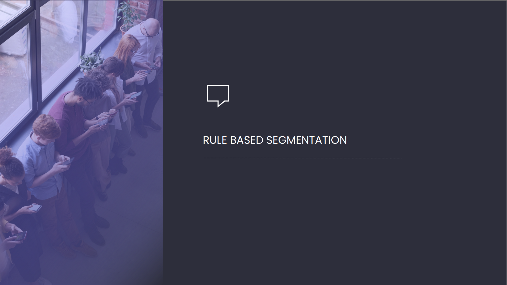

# Rule Based Segmentation



## Business Problem & Purpose

To make new customer definitions by using the characteristics of individual customers .

Segmenting new customer definitions.

Integrate system with the new future users.

---

## Project Steps

- Thinking about the concept of persona.
- To be able to define new customers according to the levels.
- Simply segment new customer definitions using the qcut function.
- When a new customer arrives, classify them according to segments.

## Dataset Information

**persona.csv** shows the characteristic features of the customers.

---

## Features

**persona.csv**

- **price:** Customer spend amount
- **source**: Type of product used by the customer. (Android, iOS)
- **sex**: Customer’s gender
- **country**: Customer's country
- **age**: Customer’s age

---

### Libraries

```
pandas
```

---

### Author

Cihan Erdoğan - [cihanerdogan99](https://github.com/cihanerdogan99)

---